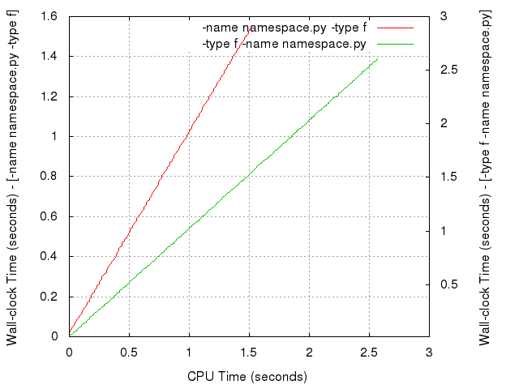

****************
General overview
****************

.. index::
   module: autobot
   single: testbot
   single: debugger
   single: profiler

:mod:`autobot` has been designed and programmed to automate scientific
experimentation. Given a particular executable (also denoted as
*solver* from now on) whose performance is about to be measured, it
provides various facilities to do so. By "measuring the performance"
the following is meant:

1. To measure both the real and CPU times of every execution of the
   given solver.

2. To measure the memory requirements of every execution of the
   specified solver.

3. To ease access to data generated by the solver either in its
   standard output or any files generated by it.

The first two points refer to its performance as computer programs
whereas the third one is relative to performance with regard to
generic variables of interest in the field of application of the
selected solver, e.g., if the solver computes inverses matrices, the
size and distribution of items are of interest and :mod:`autobot`
provides automated means to access and organize this data comfortably.

:mod:`autobot` is just a module that provides a well-defined API that
can be accessed for various purposes. :program:`testbot` is a sample
application that uses the services provided by :mod:`autobot` which is
expected to suffice for many experimental settings but, of course,
many others can be easily created. When generically speaking, both the
module :mod:`autobot` and the script :program:`testbot` are denoted as
*Testbot*.

On the opposite side, *Testbot* is neither a *debugger* nor a
*profiler*: It does not inspect the internals of the code
executed. Also, it currently provides no specific services for
creating automatically reports of any type.

.. _general-overview_motivation:

=========================
Motivation
=========================

.. index::
   pair: DRY; principle

The main motivation behind *Testbot* is the DRY (*Don't Repeat
Yourself*) principle: If the same task is been performed several times
then it might be better to automate it.

Two typical examples are discussed now and some conclusions are
drawn. From these examples, the general workflow supported by
:mod:`autobot` is discussed.

.. _general-overview_workflow_profiling:

---------------------
Example 1: Profiling 
---------------------

.. index::
   single: profiling

Assume that a scientific team has developed a new algorithm for
inverting matrices very fast and they want to compare their algorithm
with state-of-the-art implementations with respect to CPU running time
and overall memory used. Let us assume further that their
implementation creates random square matrices with a specific
:option:`range` and a specific percentage of non-null entries
specified with the option :option:`rate`. Their program can then be
invoked in various forms. The following are just some examples::

  $ inverter 100 0.2
  $ inverter --range 100 --rate 0.2
  $ inverter case1.txt

for creating 100x100 square matrices where 20% of the cells are null.

The first case assumes that the range and occupation rate are given in
a specific order; the second case uses directives to allow the user to
specify these values in any order; the last example assumes that this
information comes in a particular format in a file called
:file:`case1.txt`.

Of course, our research team will be interested in deriving figures
for different sizes of the matrices and occupation rates. Thus, an
experiment would consist of several runs (which uses the notation of
the first command above)::

  $ inverter 100 0.2
  $ inverter 200 0.2
  $ inverter 300 0.2
  $ inverter 400 0.2
  $ inverter 500 0.2

and so on, for a fixed occupation rate. However, studying how
performance is affected by varying the performance rate is interesting
and hence another experiment would be run with the following commands::

  $ inverter 100 0.2
  $ inverter 100 0.3
  $ inverter 100 0.4
  $ inverter 100 0.5
  $ inverter 100 0.6
  $ inverter 100 0.7
  $ inverter 100 0.8

and, in general, a broader experiment should be run for a large
collection of ranges and occupation rates.

.. _general-overview_workflow_organizing_data:

---------------------------
Example 2: Organizing Data
---------------------------

.. index::
   pair: organizing; data

Far from the laboratories of the research team considered in the first
example, another research team is interested in an entirely different
problem: robot navigation. Before implementing their software in the
robots for nominal operation they have decided to conduct a number of
simulations in a controlled environment. In this particular case, the
research team is not particularly interested in profiling their
software but, instead, in recording data that describes the simulated
behaviour of the robots and the decisions taken along with a full
description of the trajectory followed by every robot. Every scenario
is described in a separate file and their program is started with a
specification of the start and goal locations. The following are just
plausible examples of every run::

  $ path-planning 100 157 200 312 maze1.def
  $ path-planning --start 100 157 --goal 200 312 --scenario maze1.def
  $ path-planning case1.txt

which instruct their program, :program:`path-planning` to find a
trajectory from the start location (100, 157) to the goal location
(200, 312) in a maze described in the file :file:`maze1.def`.

Every run is expected to generate a myriad of data, e.g., the location
(*x* and *y* coordinates) of the robot every second along with other
specific information that is particularly important to assess the
ability of the algorithm to find solutions in different environments.

Of course, the research team is interested in analyzing all these data
under different settings and the same runs should be repeated for
different start and goal locations using different scenarios.

-------------------------
Example: Conclusions
-------------------------

.. index::
   single: awk
   single: SQL
   single: JASON
   single: SQLite
   pair: SQLite3; database

In the first case (see :ref:`general-overview_workflow_profiling`) the
research team is primarily interested in deriving figures about CPU
running time and different combinations of two parameters. This is
usually done by preparing the program to output information in an
easy-to-parse format. Scripts (e.g., :program:`awk`) are then
developed to automatically extract the relevant information. 

In the second case (see
:ref:`general-overview_workflow_organizing_data`) the main interest is
gathering large sets of data that have to be properly arranged. The
typical approach in this case consists of letting the main program to
write information down in some specific portable format such as SQL or
JASON. Specific scripts are then developed to extract data in the form
of tables or figures that are used to analyze information more
easily.

In general, the typical workflow consists of:

1. Running an application several times and storing all the output
   generated (either the standard output or some particular files) in
   specific locations.

   In general, to automate the execution of several cases, shell
   scripts are used.

2. To process these files to extract some data which, in turn, is also
   usually stored in a different format.

   These tasks are typically performed using :program:`awk` or any
   (interpreted) programming language that supports regular
   expressions such as Python, Ruby or Go.

3. To generate data in a readable and easy to interpret format. 

   This is done typically with software such as :program:`gnuplot` to
   create figures or :program:`GNU octave` to make additional
   computations (e.g., to compute the regression curve that better
   fits a set of points of interest).

In the end, the whole experimentation phase usually involves a large
number of scripts that have to be executed in a specific order.

Clearly, these approaches have at least two main drawbacks:

1. The scripts developed are specific to this set of experiments since
   they are relative only to the format of the output generated.

2. Importantly, these scripts (and the whole process) require
   maintenance and is dependent on several pieces of additional
   software (shell scripts, :program:`awk`, etc.)

In conclusion:

3. Any changes to the requirements affect either the format of the
   output of the program, or the scripts that extract information.

4. When the same research teams face new research projects they might
   reuse some parts of the previous scripts but, in general, they have
   to be developed anew.

Instead, :mod:`autobot` automatically enables:

* Conducting as many experiments as required with any selection of
  directives and values

* Extracting information from any text output

* Arranging data in SQLite3 databases with any definition of tables

.. _general-overview_workflow:

=========================
Workflow
=========================

.. index::
   single: experiment
   single: run
   single: gnuplot
   single: awk   
   single: GNU octave
   pair: specification; test file
   pair: specification; database file
   pair: SQLite3; database
   pair: normal; termination
   pair: enforced; termination

:mod:`autobot` makes a number of implicit assumptions with regard to
the workflow followed in the experimentation. The easiest form of this
workflow is implemented in :program:`testbot` and this section discuss
it in detail. Of course, other workflows might be more elaborated and
:mod:`autobot` provides a well-defined API to interact with
third-party software that implements them. For a thorough discussion
of it see ???.

An *experiment* is defined as a number of executions of a particular
solver, each one denoted as a *run*, all consisting of invoking the
same executable (which, in turn, can invoke other executables, create
threads, open files, etc.). Since the same experiment consists of
various runs it is expected that they are all distinguished by the
arguments given to the executable. :mod:`autobot` imposes no specific
constraint on the executable other than it has to run over an OS which
provides a :file:`proc/` filesystem such as Linux.

The workflow implemented in :mod:`autobot` consists of:

1. Writing a *test specification file* that describes the specific
   runs to execute

2. Writing a *database specification file* that describes the contents
   that should be stored in a SQLite3 database

3. To instruct :program:`testbot` to execute the desired collection of
   solvers with the files defined in points 1 and 2 with arbitrary
   limits on the memory and running time

:mod:`autobot` run the solvers specified in point 3 with the arguments
described in step 1. By default, it checks the computational resources
(i.e., CPU time and memory) used every 5 seconds and halts if any is
exceeded. Upon termination (either normal or enforced), it processes
the standard output and generates a SQLite3 database with the contents
specified in step 2:

1. Since the whole process has been automated, the whole
   experimentation can be performed without human intervention. This
   makes :mod:`autobot` a perfect candidate to run experiments on
   clusters.

2. The user has not created a single script making maintenance less
   critical.

The format of the test and database specification files is fairly easy
so that they can be generated on-the-fly, encouraging experimental
evaluation.

--------------------------------------------------
Example: Examining the GNU/Linux command 'find'
--------------------------------------------------

.. index::
   single: GNU/find
   single: find

Let us exemplify the previous concepts before going any futher. This
example shows how the performance of :program:`find` can be
significantly affected by the order of its arguments [#]_.

According to the steps depicted above:

1. A test specification file is written specifying the arguments of
   every run of our experiment::

     exec ["/home/clinares -name namespace.py -type f -print",
           "/home/clinares -type f -name namespace.py -print"];

   The directive :option:`exec` can receive either a string or a list
   of strings separated by commands and enclosed between square
   brackets. All commands in the *tb* language should be ended with a
   semicolon. This particular statement informs :program:`testbot` to
   execute two different runs. In both cases, a file named
   :file:`namespace.py` is hierarchically searched from the root
   directory :file:`/home/clinares` and all matches are shown on
   :file:`/dev/stdout`. The difference is that the first run verifies
   first the name and then the type of the entry, whereas the second
   run makes the same tests the other way around.

   These contents are saved in a directory called :file:`find.tb`

2. A database specification file is written describing the variables
   of interest that should be stored in a SQLite3 database::

     sys_time {
       id text sys.index Error;
       cputime real sys.cputime Error;
       wctime real sys.wctime Error;
     }

     sys_memory {
       id text sys.index Error;
       cputime real sys.cputime Error;
       memory real sys.vsize Error;
     }

   This database specification instructs :program:`testbot` to create
   two different databases: :file:`sys_time` and
   :file:`sys_memory`. Every database consists of various columns
   which are specified in different rows with at least three
   parameters: column name, type (which can be :const:`int`,
   :const:`real` or :const:`text`) and the variable name whose
   contents should be written into the database. Optionally, an action
   can be specified at the end. It can be either :const:`None`,
   :const:`Warning` or :const:`Error`.

   The specification of these two tables is saved in a file called
   :file:`find.db`

3. Finally, the :program:`testbot` script is executed specifying the
   command that should be run, the two files created above and the
   time (in seconds) and memory (in gigabytes) allotted for the
   execution::

     $ testbot.py --solver /usr/bin/find --test ./find.tb --db ./find.db
                  --timeout 30 --memory 1 --check 0

   Note that an additional directive was given: :option:`--check 0`
   which requests :program:`testbot` to monitor :program:`find` as
   fast as it can (instead of every 5 seconds which is the default
   value).

As a result of the previous execution, :program:`testbot` will create
a directory called :file:`find/` in the current directory with the
following contents:

* :file:`config/` which stores a copy of the test and database
  specification files. :program:`testbot` automatically backs-up this
  information which might be of interest in the future so that the
  user can safely remove the files created above.

* :file:`log/` contains various files with information about CPU,
  memory, swap memory and kernel version of the computer where the
  experiment was performed.

* :file:`results/` it contains two files per run. Every run is
  identified with three digits starting with :file:`000`. Files with
  extension :const:`.err` contain the standard error generated by the
  solver and the files with extension :const:`.log` show the standard
  output generated. In this specific case, four different files are
  created since there are two runs and both the standard output and
  standard error are recorded for each one.

* A SQLite3 database named :file:`find.db` which contains various
  tables. Just by now we will pay attention only to the tables
  :const:`sys_time` and :const:`sys_memory`::

     $ sqlite3 ./find.db ".schema sys_time"
       CREATE TABLE sys_time (id text, cputime real, wctime real);
     $ sqlite3 ./find.db ".schema sys_memory"
       CREATE TABLE sys_memory (id text, cputime real, memory real);

  which are exactly the same schemas specified in the file
  :file:`find.db`

Storing the results of the experimentation in a SQLite3 database is
very convenient. Now, GNUplot can be used immediately to obtain
various plots. For instance, the following commands::

     gnuplot> set y2tics 0, 0.5
     gnuplot> set ytics nomirror
     gnuplot> set xlabel "CPU Time (seconds)"
     gnuplot> set ylabel "Wall-clock Time (seconds) - [-name namespace.py -type f]"
     gnuplot> set y2label "Wall-clock Time (seconds) - [-type f -name namespace.py]"
     gnuplot> set grid
     gnuplot> plot "< sqlite3 ./find.db 
                      'select cputime, wctime from sys_time where id=\"000\"'
                    --separator ' '" with lines title "-name namespace.py -type f" axis x1y1, 
                   "< sqlite3 ./find.db 
                      'select cputime, wctime from sys_time where id=\"001\"'
                    --separator ' '" with lines title "-type f -name namespace.py" axis x1y2

will produce the following plot:

which shows that the first run is about one second faster than the
second. The reason is that checking the type first forces
:program:`find` to invoke :program:`stat` on every entry of the
current directory even if it does not match the given filename. It is
easy to verify that both lines are over the straigth line :math:`y=x`
so that the Wall-clock time is always greater than the CPU time as
expected.

.. rubric:: Footnotes

.. [#] For this experiment, the program :program:`find` tested is the
       one distributed with the GNU findutils 4.4.2. The execution was
       performed over an installment of ArchLinux *3.15.7-1-ARCH #1
       SMP PREEMPT Mon Jul 28 20:06:17 CEST 2014 x86_64 GNU/Linux*.
